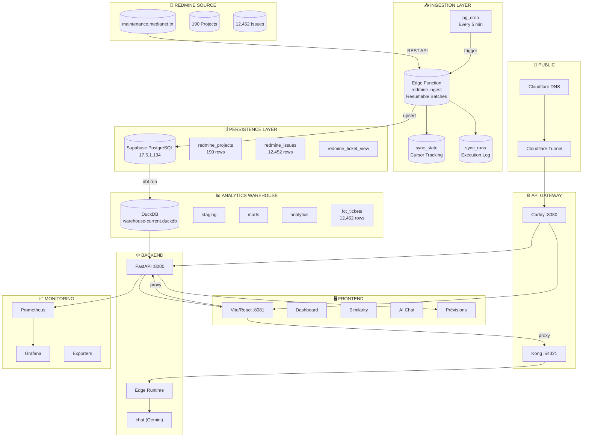
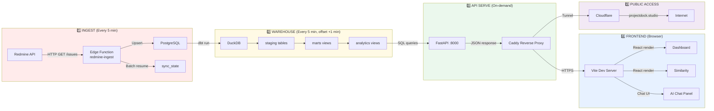
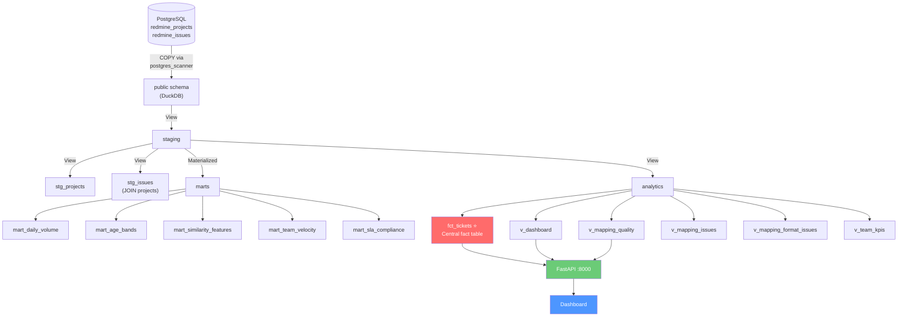
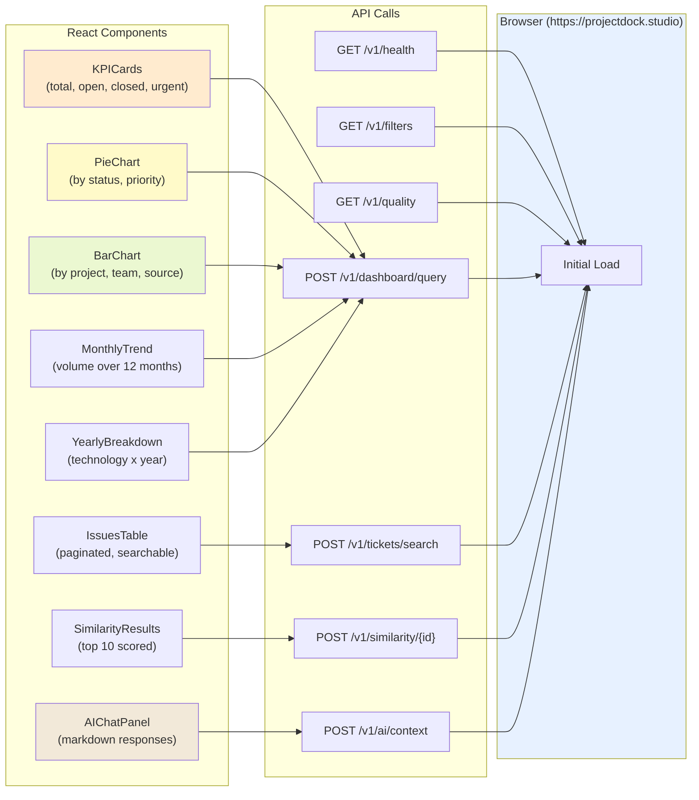
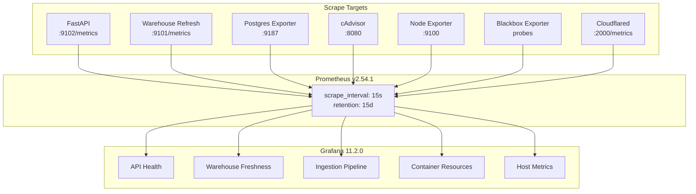
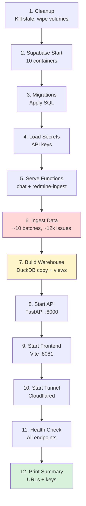

# 🏗️ Ticketing Insights Hub — Architecture & Data Pipeline

> **Live URL:** `https://projectdock.studio`  
> **Data source:** Redmine (`maintenance.medianet.tn`)  
> **Database:** 12,452 issues across 190 projects  
> **Last updated:** June 15, 2026

---

## 📋 Table of Contents

1. [System Architecture Overview](#-system-architecture-overview)
2. [End-to-End Data Flow](#-end-to-end-data-flow)
3. [Database Schema & Fact Table](#-database-schema--fact-table)
4. [Analytics Warehouse Layers](#-analytics-warehouse-layers)
5. [API Endpoints Reference](#-api-endpoints-reference)
6. [Frontend Data Consumption](#-frontend-data-consumption)
7. [Monitoring & Observability](#-monitoring--observability)
8. [Deployment & Operations](#-deployment--operations)
9. [Security Model](#-security-model)
10. [Performance & Scaling](#-performance--scaling)

---

## 🎨 System Architecture Overview

---

## 🔄 End-to-End Data Flow

### Detailed Phase Breakdown

#### Phase 1: Redmine Ingestion

| Component | Detail |
|-----------|--------|
| **Trigger** | `pg_cron` calls `trigger_redmine_ingest()` every 5 minutes |
| **Execution** | Edge Function `redmine-ingest` (TypeScript/Deno) |
| **Batch size** | 20 projects per invocation (configurable) |
| **Pagination** | 500 issues per page from Redmine API |
| **Cursor** | `sync_state` table tracks `last_offset` for resume |
| **Logging** | `sync_runs` table records metrics (issues fetched, success/failure) |
| **Error handling** | 5 retries with exponential backoff on 429/502/503 |

#### Phase 2: DuckDB Warehouse

| Component | Detail |
|-----------|--------|
| **Trigger** | Script `build_warehouse.py` called after ingestion |
| **Copy** | PostgreSQL tables → DuckDB via `postgres_scanner` extension |
| **staging** | Raw data views: `stg_projects`, `stg_issues` |
| **marts** | Aggregated views: `mart_daily_volume`, `mart_age_bands` |
| **analytics** | Business views: `fct_tickets`, `v_mapping_quality`, `v_dashboard` |
| **Size** | ~67 MB for 12,452 issues |

#### Phase 3: Analytics API

| Endpoint | Method | Purpose |
|----------|--------|---------|
| `/v1/health` | GET | Warehouse readiness + ticket count |
| `/v1/filters` | GET | All filter dropdown values |
| `/v1/dashboard/query` | POST | KPI cards + charts data |
| `/v1/tickets/search` | POST | Paginated ticket table |
| `/v1/similarity/{id}` | POST | TF-IDF cosine similarity |
| `/v1/predictions/resolution-delay/options` | GET | Eligible projects and teams |
| `/v1/predictions/resolution-delay` | POST | Six-month median resolution-delay forecast |
| `/v1/quality` | GET | Custom field mapping quality |
| `/v1/ai/context` | POST | Ticket summary for AI chat |

#### Phase 4: Frontend

| Route | Component | Data Source |
|-------|-----------|-------------|
| `/` | Dashboard | `fct_tickets` via `/v1/dashboard/query` |
| `/similarity` | Cas similaires | Same ticket pool + `/v1/similarity/{id}` |
| `/predictions` | Prévisions | Resolution-delay forecast and probable range |
| Chat Panel | AI Chat Assistant | `/functions/v1/chat` → Gemini |

#### Phase 5: Public Access

| Layer | Technology | Purpose |
|-------|-----------|---------|
| Proxy | Caddy 2.10 | Route requests, rate limit, Basic Auth |
| Tunnel | `cloudflared` 2026.6.0 | Named tunnel `projectdock` |
| DNS | Cloudflare | CNAME → `*.cfargotunnel.com` |
| SSL | Cloudflare | Full (strict) TLS mode |
| Admin Auth | Caddy Basic Auth | `/admin/studio`, `/admin/grafana` |

---

## 📊 Database Schema & Fact Table

### `analytics.fct_tickets` — The Central Fact Table

This is the single source of truth for all dashboard queries, similarity analysis, and AI context.

| # | Column | Type | Source Column | Description |
|---|--------|------|---------------|-------------|
| 1 | `id` | VARCHAR | `redmine_issues.redmine_id` | Unique ticket identifier |
| 2 | `project_name` | VARCHAR | JOIN with `redmine_projects` | Project the ticket belongs to |
| 3 | `tracker` | VARCHAR | `redmine_issues.tracker_name` | Issue tracker type (Bug, Feature, etc.) |
| 4 | `status` | VARCHAR | `redmine_issues.status_name` | Current workflow status |
| 5 | `priority` | VARCHAR | `redmine_issues.priority_name` | Priority level (Urgent, Normal, etc.) |
| 6 | `subject` | VARCHAR | `redmine_issues.subject` | One-line summary |
| 7 | `author` | VARCHAR | `redmine_issues.author_name` | Ticket creator |
| 8 | `assignee` | VARCHAR | `redmine_issues.assigned_to_name` | Current assignee |
| 9 | `created_date` | TIMESTAMPTZ | `redmine_issues.created_on` | Creation timestamp |
| 10 | `closed_date` | TIMESTAMPTZ | `redmine_issues.closed_on` | Closure timestamp |
| 11 | `resolved_date` | TIMESTAMPTZ | `redmine_issues.resolved_on` | Resolution timestamp (NULL if invalid) |
| 12 | `team` | VARCHAR | `redmine_issues.team` | Assigned team (custom field mapping) |
| 13 | `technology` | VARCHAR | `redmine_issues.technology` | Technology stack (custom field) |
| 14 | `type` | VARCHAR | COALESCE(nature, intervention, type) | Enriched ticket type |
| 15 | `satisfaction` | VARCHAR | `redmine_issues.satisfaction` | Customer satisfaction score |
| 16 | `source` | VARCHAR | `redmine_issues.source` | Ticket origin |
| 17 | `fichiers` | VARCHAR | `redmine_issues.fichiers` | Attachment filenames |
| 18 | `has_attachment` | BOOLEAN | `redmine_issues.has_attachment` | Has files attached |
| 19 | `canal` | VARCHAR | `redmine_issues.canal` | Communication channel |
| 20 | `segment_client` | VARCHAR | `redmine_issues.segment_client` | Customer segment |
| 21 | `region` | VARCHAR | `redmine_issues.region` | Geographic region |
| 22 | `reopened` | VARCHAR | `redmine_issues.reopened` | Reopened flag (Oui/Non) |
| 23 | `sla_plan` | VARCHAR | `redmine_issues.sla_plan` | SLA plan name |
| 24 | `nature` | VARCHAR | `redmine_issues.nature` | Issue nature (custom field) |
| 25 | `intervention_type` | VARCHAR | `redmine_issues.intervention_type` | Intervention category |
| 26 | `created_year` | INTEGER | EXTRACT from `created_on` | Year for time-series |
| 27 | `created_month` | INTEGER | EXTRACT from `created_on` | Month for seasonality |
| 28 | `age_hours` | FLOAT | Computed from dates | Ticket age for similarity |

### Supporting Analytics Views

| View | Purpose | Rows |
|------|---------|------|
| `analytics.v_dashboard` | Per-project KPI summary | 167 rows (one per project) |
| `analytics.v_team_kpis` | Per-team performance | Team × Project combinations |
| `analytics.v_mapping_quality` | Custom field mapping quality | 4 fields (team, tech, source, satisfaction) |
| `analytics.v_mapping_issues` | Individual mapping examples | 100 sample tickets |
| `analytics.v_mapping_format_issues` | Date format issues | 50 sample tickets |

---

## 📊 Analytics Warehouse Layers

### Layer Descriptions

| Layer | Schema | Materialization | Refresh | Purpose |
|-------|--------|-----------------|---------|---------|
| **public** | `public` | Table | On script run | Raw Postgres copy |
| **staging** | `staging` | View | On query | Cleaned, deduped source |
| **marts** | `marts` | Materialized View | Scheduled | Pre-aggregated business data |
| **analytics** | `analytics` | View | On query | Dashboard-ready structures |

---

## 🌐 API Endpoints Reference

### Analytics API (`analytics_service`)

| Endpoint | Method | Auth | Input | Output |
|----------|--------|------|-------|--------|
| `/v1/health` | GET | None | — | `{ok, warehouseReady, tickets}` |
| `/v1/filters` | GET | Token | — | `{project: [...], status: [...]}` |
| `/v1/dashboard/query` | POST | Token | `{filters}` | KPIs + chart data |
| `/v1/tickets/search` | POST | Token | `{page, pageSize, search, filters}` | Paginated tickets |
| `/v1/similarity/{id}` | POST | Token | `{topN, filters}` | Similar tickets ranked |
| `/v1/predictions/resolution-delay/options` | GET | Token | — | Eligible projects, teams, thresholds |
| `/v1/predictions/resolution-delay` | POST | Token | `{scope, horizonMonths: 6}` | History, forecast, 80% range, model quality |
| `/v1/quality` | GET | Token | — | Mapping quality metrics |
| `/v1/ai/context` | POST | Token | `{filters}` | LLM-ready summary |

### Supabase Edge Functions

| Endpoint | Method | Auth | Purpose |
|----------|--------|------|---------|
| `/functions/v1/redmine-ingest` | POST | Service Key | Trigger data sync |
| `/functions/v1/chat` | POST | Anon Key | AI chat assistant |

### Proxy Routing (Caddy)

| Path | Target | Auth |
|------|--------|------|
| `/` | Frontend :8081 | None |
| `/api/analytics/*` | FastAPI :8000 | None |
| `/functions/v1/*` | Kong :54321 | Rate-limited (chat) |
| `/admin/studio/*` | Studio :54323 | Basic Auth |
| `/admin/grafana/*` | Grafana :3000 | Basic Auth |

---

## 🖥️ Frontend Data Consumption

### Component Data Mapping

| Component | Endpoint | Refresh |
|-----------|----------|---------|
| KPICards | `/v1/dashboard/query` | On filter change |
| Status Pie | `/v1/dashboard/query` → `charts.status` | On filter change |
| Priority Pie | `/v1/dashboard/query` → `charts.priority` | On filter change |
| Project Bar | `/v1/dashboard/query` → `charts.project` | On filter change |
| Technology × Year | `/v1/dashboard/query` → `charts.technologyByYear` | On filter change |
| Monthly Volume | `/v1/dashboard/query` → `charts.monthly` | On filter change |
| Ticket Table | `/v1/tickets/search` | Paginated (50/page) |
| Similarity | `/v1/similarity/{id}` | On ticket selection |
| Prévisions | `/v1/predictions/resolution-delay` | On scope change |
| AI Context | `/v1/ai/context` | Per-chat message |
| Quality Panel | `/v1/quality` | On page load |

---

## 📈 Monitoring & Observability

### Key Metrics

| Metric | Source | Description |
|--------|--------|-------------|
| `ticketing_api_requests_total` | FastAPI | API request counter by route/status |
| `ticketing_api_request_duration_seconds` | FastAPI | API latency histogram |
| `ticketing_warehouse_published_tickets` | Refresh Worker | Tickets in latest warehouse |
| `ticketing_warehouse_age` | Refresh Worker | Seconds since last publish |
| `ticketing_warehouse_mapping_failures` | Refresh Worker | Custom field mapping failures |
| `pg_stat_database_tup_fetched` | Postgres Exporter | DB read throughput |
| `container_memory_usage_bytes` | cAdvisor | Per-container memory |
| `node_cpu_seconds_total` | Node Exporter | Host CPU utilization |
| `probe_success` | Blackbox | HTTP endpoint reachability |

---

## 🚀 Deployment & Operations

### Stack Components

| Service | Image | Port | Resources |
|---------|-------|------|-----------|
| PostgreSQL | `supabase/postgres:17.6.1.134` | 54322 | 2 GB RAM limit |
| Kong | `kong:2.8.1` | 54321 | 384 MB RAM limit |
| GoTrue (Auth) | `supabase/gotrue:v2.189.0` | — | 256 MB |
| PostgREST | `postgrest/postgrest:v14.13` | — | 256 MB |
| Edge Runtime | `supabase/edge-runtime:v1.74.1` | — | 512 MB |
| Studio | `supabase/studio:2026.06.08` | 54323 | 768 MB |
| FastAPI | Custom (Python 3.12) | 8000 | 768 MB |
| Forecasting | statsmodels 0.14.4 | — | Seasonal naïve, damped Holt, Holt-Winters |
| Frontend | Vite Dev Server | 8081 | 128 MB |
| Caddy | `caddy:2.10.0` | 8080 | 128 MB |
| Cloudflared | `cloudflared:2026.6.0` | — | 128 MB |
| Prometheus | `prom/prometheus:v2.54.1` | — | 384 MB |
| Grafana | `grafana/grafana:11.2.0` | 3000 | 384 MB |

### Startup Order

### Recovery Procedures

| Scenario | Procedure |
|----------|-----------|
| **Supabase down** | `autoheal` restarts unhealthy containers after 3 consecutive failures |
| **API crash** | `autoheal` monitors label `com.ticketing.autoheal=true` |
| **Warehouse corruption** | Delete `/tmp/warehouse-current.duckdb` and run `build_warehouse.py` |
| **Ingestion failure** | Script retries with exponential backoff, logs to `sync_runs` |
| **Tunnel disconnect** | `url-watcher` monitors and restarts tunnel if URL disappears |
| **Full outage** | Run `bash scripts/run-everything.sh` from clean state |

---

## 🔐 Security Model

| Layer | Mechanism |
|-------|-----------|
| **DNS** | Cloudflare nameservers (kellen/tiffany.ns.cloudflare.com) |
| **Transport** | TLS 1.3 via Cloudflare Tunnel |
| **API Auth** | Supabase JWT tokens (anon + service_role) |
| **Admin Routes** | Caddy Basic Auth (`/admin/studio`, `/admin/grafana`) |
| **Rate Limiting** | Caddy: 10 req/min for `/functions/v1/chat` |
| **Container Security** | `autoheal` runs with read-only FS, no capabilities |
| **Secrets** | `deploy/secrets/runtime.env` (mode 0600, git-ignored) |
| **Backups** | Daily pg_dump with SHA-256 checksums, 14-day retention |
