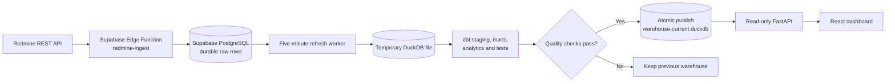
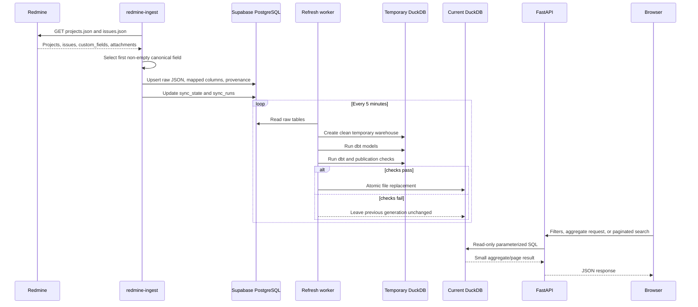
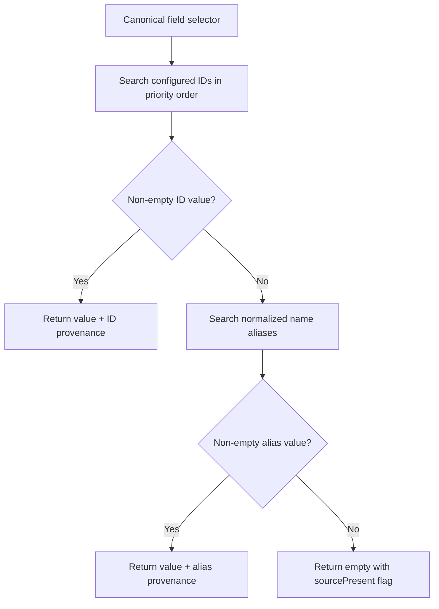
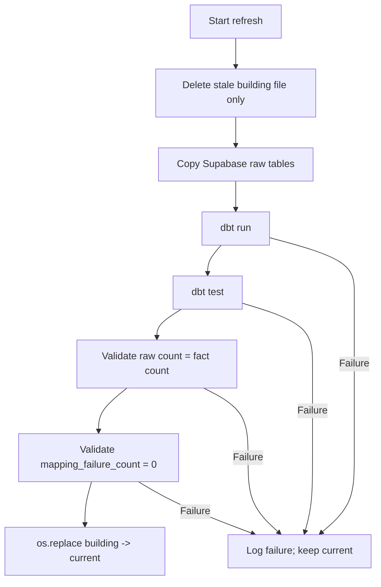
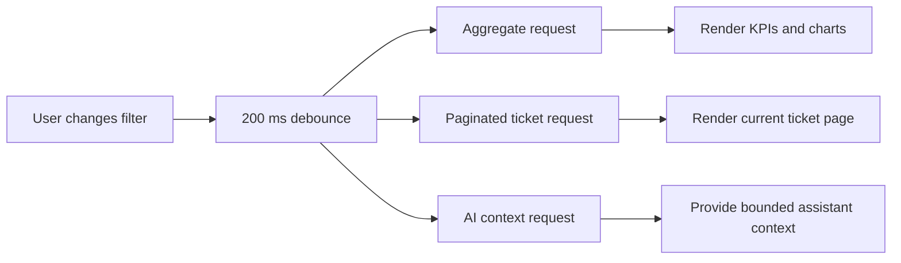
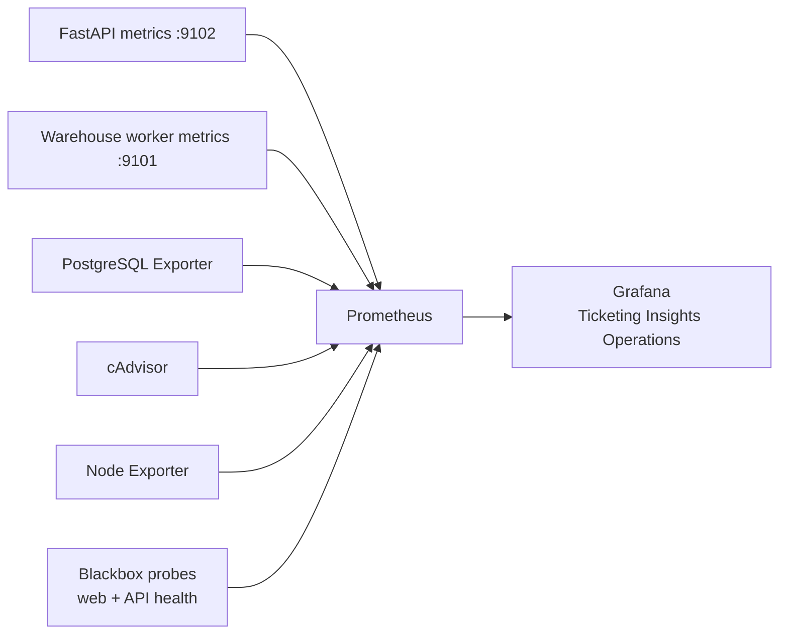

# Ticketing Insights Hub

## End-to-End Data Pipeline and Analytics Report

**Effective architecture:** June 11, 2026  
**Scope:** Redmine ingestion, Supabase raw storage, DuckDB warehouse, dbt models,
FastAPI analytics, dashboard queries, custom-field quality, similarity, and AI context.

> The ticket examples below are fictional. They demonstrate transformations without
> exposing production data.

---

## 1. Architectural Decision

The system now has two different authorities:

| Concern | Authoritative system |
|---|---|
| Original business data | Redmine |
| Durable ingested rows and synchronization state | Supabase PostgreSQL |
| Dashboard analytics and application queries | DuckDB |
| Transformation definitions and tests | dbt |

DuckDB is now the **analytical source of truth**. Supabase remains the durable raw
store and synchronization authority. The dashboard no longer downloads the complete
`redmine_ticket_view` dataset or calculates every chart in the browser.



---

## 2. Actors and Responsibilities

| Actor | Responsibility | Does not do |
|---|---|---|
| Redmine | Owns projects, issues, and custom-field values | Dashboard aggregation |
| `redmine-ingest` | Fetches, maps, records provenance, and upserts | Invent missing values |
| Supabase PostgreSQL | Persists raw JSON, mapped columns, sync state, and sync runs | Serve dashboard analytics |
| Refresh worker | Copies raw tables, runs dbt/tests, and publishes atomically | Modify Redmine or Supabase |
| DuckDB | Stores cleaned facts, marts, quality views, and query-ready analytics | Act as the business source |
| dbt | Defines repeatable SQL transformations and quality tests | Run browser UI |
| FastAPI | Executes parameterized DuckDB queries with limits | Return the entire warehouse |
| React | Renders API results and sends filter selections | Parse all tickets client-side |

---

## 3. Complete Runtime Flow



---

## 4. Example Ticket at Every Phase

### 4.1 Redmine source response

This source ticket contains an empty `Nature` but a populated
`Type d'intervention`.

```json
{
  "id": 42001,
  "project": {"id": 44, "name": "Example Portal"},
  "tracker": {"name": "Support"},
  "status": {"name": "Resolved"},
  "priority": {"name": "Normal"},
  "subject": "Update homepage campaign",
  "created_on": "2026-05-10T08:00:00Z",
  "closed_on": "2026-05-12T16:00:00Z",
  "custom_fields": [
    {"id": 17, "name": "Nature", "value": ""},
    {"id": 18, "name": "Type d'intervention", "value": "Webmastering"},
    {"id": 5, "name": "CMS / Framework", "value": "Drupal"},
    {"id": 8, "name": "Equipe Affectee", "value": ["Web", "Support"]},
    {"id": 3, "name": "Date Resolved", "value": "2026-05-12"}
  ]
}
```

At this phase Redmine is the only actor. No analytics field has been derived.

### 4.2 Ingestion selection

Each canonical field is resolved independently. IDs are searched before normalized
name aliases. A matching empty candidate does not stop the search.

```text
Nature selector:
  ID 17 -> present but empty
  result -> empty, sourcePresent=true

Intervention type selector:
  ID 18 -> "Webmastering"
  result -> "Webmastering", method=id

Dashboard type rule:
  Nature when non-empty
  otherwise Intervention Type
  result -> "Webmastering"
```

The ingestion function never infers a value from the subject, tracker, project, or
another ticket.

### 4.3 Supabase durable raw row

```json
{
  "redmine_id": 42001,
  "project_name": "Example Portal",
  "tracker_name": "Support",
  "subject": "Update homepage campaign",
  "technology": "Drupal",
  "team": "Web, Support",
  "nature": "",
  "intervention_type": "Webmastering",
  "type": "Webmastering",
  "resolved_on": "2026-05-12T00:00:00.000Z",
  "custom_fields_json": "[original Redmine custom fields]",
  "raw_json": "[complete original Redmine issue]",
  "field_mapping_json": {
    "nature": {
      "value": "",
      "sourceId": null,
      "sourceName": "",
      "method": "missing",
      "sourcePresent": true,
      "nonEmptyCandidateCount": 0,
      "conflict": false
    },
    "interventionType": {
      "value": "Webmastering",
      "sourceId": 18,
      "sourceName": "Type d'intervention",
      "method": "id",
      "sourcePresent": true,
      "nonEmptyCandidateCount": 1,
      "conflict": false
    }
  }
}
```

Supabase stores both convenient mapped columns and evidence needed to audit them.

### 4.4 DuckDB staging row

`staging.stg_issues` applies consistent names, null handling, dates, age, and SLA
logic.

| Column | Value | Transformation |
|---|---:|---|
| `id` | `42001` | `redmine_id` renamed |
| `project_name` | `Example Portal` | Empty text normalized |
| `type` | `Webmastering` | Nature, then intervention type |
| `team` | `Web, Support` | Array already normalized during ingestion |
| `created_date` | `2026-05-10` | Timestamp cast to date |
| `resolved_date` | `2026-05-12` | Custom resolved date cast to date |
| `age_hours` | `56` | Created-to-closed duration |
| `is_open` | `false` | Derived from `closed_on` |

### 4.5 DuckDB analytical fact

`analytics.fct_tickets` is the canonical ticket-level dataset used by the API. It
contains cleaned dimensions, dates, derived year/month, attachments, raw custom
fields, full raw JSON, and mapping provenance.

### 4.6 API aggregate response

When the user filters to project `Example Portal`, FastAPI sends a parameterized
query to DuckDB:

```sql
select coalesce(nullif(type, ''), 'Not provided') as name, count(*) as value
from analytics.fct_tickets
where project_name = ?
group by 1
order by value desc;
```

The browser receives only the chart result:

```json
[
  {"name": "Webmastering", "value": 73},
  {"name": "Development", "value": 41},
  {"name": "Not provided", "value": 4}
]
```

It does not receive thousands of unrelated tickets.

---

## 5. Canonical Redmine Field Mapping

Verified IDs are the primary keys:

| Canonical field | Redmine ID | Fallback aliases |
|---|---:|---|
| Satisfaction | `1` | satisfaction name variants |
| Date Resolved | `3` | `Date Resolved`, `resolved_date` |
| Technology | `5` | `CMS / Framework`, technology variants |
| Team | `8` | team name variants |
| Source | `12` | `Source`, `source` |
| Nature | `17` | `Nature`, `nature` |
| Intervention Type | `18` | `Type d'intervention`, `intervention_type` |

`Nature` and `Type d'intervention` are separate fields. They are not aliases of one
another.



Scalar values are trimmed. Array values are flattened into a comma-separated string
after empty entries are removed.

---

## 6. Data Quality Meanings

The dashboard must not put every empty-looking result into one category.

| Quality status | Meaning | Publication |
|---|---|---|
| `mapped` | A source value was mapped successfully | Allowed |
| `source_empty` | Redmine returned the field but its source value was empty | Allowed and shown as `Not provided` |
| `source_absent` | The field was not present in the Redmine issue response | Allowed and reported separately |
| `conflict` | Multiple populated candidates had different values | Published but highlighted for review |
| `mapping_failure` | A populated candidate existed but the mapped output became empty | Warehouse publication fails |

Quality is reported by field, project, and tracker through:

- `analytics.v_mapping_quality`
- `analytics.v_mapping_issues`
- `GET /v1/quality`
- the dashboard data-quality panel

The panel shows warehouse publication time, coverage, genuine source empties,
absent fields, conflicts, mapping failures, and representative ticket IDs.

---

## 7. Full Redmine Audit

The repository includes a complete custom-field audit:

```powershell
npm run audit:redmine:custom-fields
```

It records:

- field ID, exact name, and normalized name;
- presence and non-empty counts;
- scalar/array/null value types;
- representative ticket IDs;
- every discovered project;
- accessible project issue counts;
- projects returning HTTP `403`;
- other project-fetch failures.

The audit distinguishes access restrictions from ingestion omissions. Its JSON
output can be redirected to an audit artifact when a dated review is required.

---

## 8. Warehouse Refresh and Atomic Publication

The `warehouse-refresh` Docker service runs every 300 seconds by default.



The API opens `warehouse-current.duckdb` in read-only mode. It never reads the
building file. A failed refresh therefore cannot replace a known-good generation.

---

## 9. DuckDB Models

| Layer | Main objects | Purpose |
|---|---|---|
| `public` | copied Supabase raw tables | Reproducible warehouse input |
| `staging` | `stg_issues`, `stg_projects` | Clean names, types, dates, and nulls |
| `marts` | daily volume, team velocity, SLA, age bands, similarity features | Reusable analytical logic |
| `analytics` | `fct_tickets`, dashboard views, mapping quality views | API-facing query layer |

`analytics.fct_tickets` is the API’s ticket-level contract. Dashboard filters and
charts use this table rather than browser-side parsing.

---

## 10. Analytics API

FastAPI validates the configured Supabase publishable token or a Supabase JWT. All
filter values are SQL parameters, sort fields use an allowlist, page size is capped,
and DuckDB connections are read-only.

| Endpoint | Purpose |
|---|---|
| `GET /v1/health` | Warehouse readiness |
| `GET /v1/metadata` | Freshness and row/project counts |
| `GET /v1/filters` | Canonical non-empty filter values |
| `POST /v1/dashboard/query` | KPIs and chart aggregates |
| `POST /v1/tickets/search` | Search, sorting, and pagination |
| `GET /v1/tickets/{id}` | Mapped row, provenance, custom fields, and raw JSON |
| `POST /v1/similarity/{id}` | Server-side similarity ranking |
| `POST /v1/ai/context` | Bounded aggregate context for the AI assistant |
| `GET /v1/quality` | Freshness, quality totals, and affected examples |

---

## 11. Dashboard Behavior



The browser now:

- fetches canonical filter options from DuckDB;
- requests pre-aggregated chart data;
- displays only the requested ticket page;
- requests similarity from the server;
- never loads the complete ticket table for dashboard calculations;
- labels genuine missing source values as `Not provided`;
- exposes mapping failures separately in the quality panel.

The performance target is under one second per dashboard response for fewer than
100,000 tickets, subject to deployment resources and filter complexity.

---

## 12. Similarity and AI

Similarity candidates are selected from DuckDB using the active dashboard filters.
Text and numeric similarity calculations run behind the API, and only the top
bounded result set is returned.

AI context is also built from DuckDB aggregates. The browser sends a compact summary
of selected KPIs and top dimensions to the existing chat function instead of
constructing context from every raw ticket.

---

## 13. Failure Scenarios

| Failure | System response |
|---|---|
| Redmine field exists but first candidate is empty | Continue searching |
| Project issue endpoint returns `403` | Record as inaccessible; do not call it an ingestion omission |
| Supabase copy fails | Keep current DuckDB |
| dbt model or test fails | Keep current DuckDB |
| Populated source maps to empty | Fail publication |
| API starts before first warehouse | Return HTTP `503` / not-ready health |
| User requests too many rows | Enforce maximum page size |
| Invalid sort field | Replace with allowed default |

---

## 14. Verification

Implemented automated checks include:

- first non-empty custom-field selection;
- empty Nature with populated intervention type;
- populated Nature with empty intervention type;
- array values;
- accented name normalization;
- stable ID matching after field rename;
- all candidates empty;
- resolved date conversion;
- unique/not-null fact identifiers;
- mapping provenance presence;
- accepted quality statuses;
- no populated-source mapping losses;
- raw issue count equal to analytical fact count before publication;
- frontend TypeScript compilation and production build.

Commands:

```powershell
npm test
npm run build
npm run warehouse:duckdb:test
docker compose -f docker-compose.yml -f docker-compose.web-local.yml config
```

---

## 15. Local Operation

The full local workflow remains:

```powershell
npm run local:e2e:ps
```

It starts Supabase, applies migrations, performs Redmine ingestion, starts the
warehouse worker and API, waits for the first atomic DuckDB publication, and starts
the web application.

Default local addresses:

| Service | Address |
|---|---|
| Dashboard | `http://127.0.0.1:8081` |
| Analytics API | `http://127.0.0.1:8000` |
| API health | `http://127.0.0.1:8000/v1/health` |
| Supabase API | `http://127.0.0.1:54321` |

---

## 16. Operations Monitoring

Monitoring is an optional Docker Compose profile:

```powershell
docker compose --profile monitoring up -d
```



Prometheus scrapes every 15 seconds. Warehouse-derived metrics are cached for 60
seconds so monitoring does not repeatedly scan DuckDB. The API exports request
rate, normalized route/status totals, latency, concurrency, readiness, warehouse
age, ticket/project counts, and mapping-quality totals. The refresh worker exports
attempt results, duration, in-progress state, last successful publication, ticket
count, and mapping failures.

Grafana and Prometheus bind only to localhost:

| Service | Address |
|---|---|
| Grafana | `http://127.0.0.1:3000` |
| Prometheus | `http://127.0.0.1:9090` |

No Alertmanager or external Slack/email notification delivery is configured in
this phase. On Docker Desktop, Node Exporter measures the Linux Docker VM; on a
Linux server it measures the production Docker host.

## 17. SonarQube Cloud

GitHub Actions produces LCOV coverage for React/TypeScript and XML coverage for
the Python analytics service. SonarQube Cloud scans the frontend, Python service,
Supabase functions, dbt SQL, and operational scripts.

Required GitHub Actions secrets:

- `SONAR_TOKEN`
- `SONAR_ORGANIZATION`
- `SONAR_PROJECT_KEY`

The Sonar quality gate is initially advisory. Scanner or configuration failures
fail the Sonar job, but quality-gate results do not block pull requests or
deployment. Bind the SonarQube Cloud project to this GitHub repository to enable
pull-request decoration.

---

## 18. Final Lineage

```text
Redmine issue
  -> exact source custom fields
  -> first non-empty ID/name mapping
  -> Supabase mapped columns + raw JSON + provenance
  -> temporary DuckDB raw copy
  -> dbt staging
  -> analytics.fct_tickets and quality views
  -> publication validation
  -> atomic current DuckDB file
  -> authenticated read-only FastAPI
  -> aggregate, paginated, similarity, and AI-context responses
  -> React dashboard
```

The defining rule from now on is:

> Redmine owns the business truth, Supabase preserves the durable ingestion truth,
> and DuckDB owns the application’s analytical truth.
