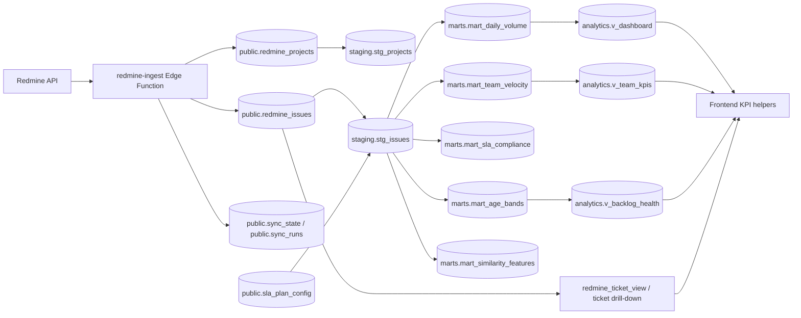

# Ticketing Insights Hub Warehouse Explained

This document explains the warehouse end to end: what it stores, how it is refreshed, how dbt connects to it, and how the frontend consumes it.

## Big Picture

The system has three layers:

1. Redmine data is ingested into Supabase raw tables.
2. dbt transforms the raw tables into staging and mart layers.
3. The frontend reads either the raw ticket view or the warehouse views, depending on the screen.



## What Each Layer Does

### 1. Raw layer

The ingest function writes Redmine data into the `public` schema:

- `public.redmine_projects` stores projects.
- `public.redmine_issues` stores issues.
- `public.sync_state` stores the cursor and sync status.
- `public.sync_runs` stores execution history and errors.
- `public.sla_plan_config` stores the mapping from SLA labels to target hours.

Relevant files:

- [supabase/functions/redmine-ingest/index.ts](supabase/functions/redmine-ingest/index.ts)
- [supabase/migrations/20260408120000_redmine_pipeline.sql](supabase/migrations/20260408120000_redmine_pipeline.sql)
- [supabase/migrations/20260526000000_create_staging_schema.sql](supabase/migrations/20260526000000_create_staging_schema.sql)

### 2. Staging layer

The `staging` schema holds cleaned, typed materialized views:

- `staging.stg_projects` is a cleaned copy of `public.redmine_projects`.
- `staging.stg_issues` is a cleaned copy of `public.redmine_issues` with derived columns such as `age_hours`, `is_open`, `sla_breached`, and `sla_target_hours`.

This layer does the standardization work so downstream queries stay simple and fast.

### 3. Mart layer

The `marts` schema contains business aggregations used for reporting:

- `marts.mart_daily_volume` tracks tickets opened and closed per day.
- `marts.mart_team_velocity` tracks weekly team throughput and average resolution time.
- `marts.mart_sla_compliance` tracks SLA compliance by project, team, and week.
- `marts.mart_age_bands` tracks open backlog tickets by age bucket.
- `marts.mart_similarity_features` pre-flattens text used for similarity matching.

Relevant files:

- [supabase/migrations/20260526000100_create_marts_schema.sql](supabase/migrations/20260526000100_create_marts_schema.sql)
- [ticketing_warehouse/models/marts/mart_daily_volume.sql](ticketing_warehouse/models/marts/mart_daily_volume.sql)
- [ticketing_warehouse/models/marts/mart_team_velocity.sql](ticketing_warehouse/models/marts/mart_team_velocity.sql)
- [ticketing_warehouse/models/marts/mart_sla_compliance.sql](ticketing_warehouse/models/marts/mart_sla_compliance.sql)
- [ticketing_warehouse/models/marts/mart_age_bands.sql](ticketing_warehouse/models/marts/mart_age_bands.sql)

### 4. Analytics layer

The `analytics` schema exposes frontend-friendly views:

- `analytics.v_dashboard`
- `analytics.v_team_kpis`
- `analytics.v_backlog_health`

These are the stable, high-level queries the UI can read instead of scanning raw tickets every time.

Relevant file:

- [supabase/migrations/20260526000200_create_analytics_schema.sql](supabase/migrations/20260526000200_create_analytics_schema.sql)

## Full Flow

1. `redmine-ingest` fetches all projects from Redmine.
2. It upserts those projects into `public.redmine_projects`.
3. It fetches issues project by project, in batches, so it can resume safely.
4. It maps Redmine custom fields into normalized columns such as team, technology, type, satisfaction, source, canal, region, reopened, and SLA plan.
5. It upserts the issues into `public.redmine_issues`.
6. It writes cursor state into `public.sync_state` and run history into `public.sync_runs`.
7. `pg_cron` runs `public.refresh_warehouse()` every 6 minutes, offset by one minute from the ingest cadence.
8. `public.refresh_warehouse()` refreshes staging first, then marts, then logs the refresh in `sync_runs`.
9. The frontend reads warehouse views for KPI summaries and reads `redmine_ticket_view` for the detailed ticket table.
10. The similarity page uses the ticket list plus precomputed similarity logic in the app layer.

## How The Refresh Works

The scheduling is split into two cron jobs:

- `redmine_ingest_every_5m` triggers the ingest function every 5 minutes.
- `refresh-warehouse-views` triggers `public.refresh_warehouse()` every 6 minutes starting at minute 1.

That offset matters because it gives the ingest job time to finish its upsert before the warehouse refresh runs.

Relevant files:

- [supabase/migrations/20260408131500_redmine_ingest_cron.sql](supabase/migrations/20260408131500_redmine_ingest_cron.sql)
- [supabase/migrations/20260526000300_schedule_mart_refresh.sql](supabase/migrations/20260526000300_schedule_mart_refresh.sql)

To run a manual refresh:

```sql
select public.refresh_warehouse();
```

To check the last refresh:

```sql
select source, started_at, ended_at, status, metrics_json
from public.sync_runs
where source = 'warehouse_refresh'
order by started_at desc
limit 10;
```

## How To Connect It

There are three different connection points.

### Local DuckDB Warehouse Option

DuckDB can be used as a local analytical warehouse beside Supabase/Postgres.
Supabase remains the operational database; DuckDB stores a local development
copy in [ticketing_warehouse/warehouse.duckdb](ticketing_warehouse/warehouse.duckdb).

Install the local dependencies:

```bash
pip install duckdb dbt-duckdb
```

Local architecture:

```text
Redmine API
   |
Supabase Edge Function
   |
Supabase Postgres raw tables
   |
DuckDB local warehouse file: warehouse.duckdb
   |
dbt-duckdb transformations
   |
staging / marts / analytics outputs
```

Run the local DuckDB warehouse after local Supabase is running:

```bash
npm run warehouse:duckdb:bootstrap
npm run warehouse:duckdb:run
npm run warehouse:duckdb:test
npm run warehouse:duckdb:validate
```

The bootstrap script copies `public.redmine_projects`,
`public.redmine_issues`, and `public.sla_plan_config` from local Supabase
Postgres at `127.0.0.1:54322` into DuckDB. The dbt `duckdb` target is in
[ticketing_warehouse/profiles.yml](ticketing_warehouse/profiles.yml), and a
copy/paste profile example is available at
[ticketing_warehouse/profiles.duckdb.example.yml](ticketing_warehouse/profiles.duckdb.example.yml).

The frontend is not rewired for DuckDB. It still reads Supabase views through
[src/lib/loadDashboardKPIs.ts](src/lib/loadDashboardKPIs.ts) and detailed
tickets through [src/lib/loadTickets.ts](src/lib/loadTickets.ts). DuckDB is
optional and mainly for local analytical development, testing, and demos.

### A. Connect dbt to Supabase Postgres

dbt uses [ticketing_warehouse/profiles.yml](ticketing_warehouse/profiles.yml).

Set these environment variables:

- `DBT_SUPABASE_HOST`
- `DBT_SUPABASE_PORT` for local runs
- `DBT_SUPABASE_USER`
- `DBT_SUPABASE_PASSWORD`
- `DBT_SUPABASE_DBNAME`

Typical local values:

- host: `127.0.0.1`
- port: `54322`
- database: `postgres`
- user: `postgres`

Typical cloud values:

- host: your Supabase database host
- port: `5432`
- SSL enabled

Run dbt from the warehouse folder:

```bash
cd ticketing_warehouse
dbt deps
dbt run
dbt test
```

### B. Connect the frontend to Supabase

The frontend connects through [src/integrations/supabase/client.ts](src/integrations/supabase/client.ts).

Set:

- `VITE_SUPABASE_URL`
- `VITE_SUPABASE_PUBLISHABLE_KEY`

The detailed ticket list comes from `loadTickets()` in [src/lib/loadTickets.ts](src/lib/loadTickets.ts). It first tries `redmine_ticket_view` and falls back to the bundled CSV if Supabase is unavailable.

### C. Connect the ingest function to Redmine and Supabase

The ingest function needs:

- `REDMINE_URL`
- `REDMINE_API_KEY`
- `SUPABASE_URL`
- `SUPABASE_SERVICE_ROLE_KEY`

Optional tuning variables include:

- `REDMINE_PAGE_SIZE`
- `REDMINE_PROJECT_BATCH_SIZE`
- `REDMINE_FIELD_*` aliases for custom-field mapping

## What The Frontend Uses Today

The frontend already has a warehouse KPI helper in [src/lib/loadDashboardKPIs.ts](src/lib/loadDashboardKPIs.ts), which reads:

- `analytics.v_dashboard`
- `analytics.v_team_kpis`
- `analytics.v_backlog_health`

However, the main dashboard screen currently still loads the detailed ticket list through `loadTickets()` and computes most charts client-side in [src/pages/Dashboard.tsx](src/pages/Dashboard.tsx).

So the warehouse is connected in two ways:

1. As the backend transformation layer that powers the analytics views.
2. As an available frontend KPI source through `loadDashboardKPIs.ts`, even if the default dashboard flow still leans on raw tickets.

## dbt Structure

The dbt project is in [ticketing_warehouse/dbt_project.yml](ticketing_warehouse/dbt_project.yml).

It defines:

- `staging` models as materialized views in the `staging` schema.
- `marts` models as materialized views in the `marts` schema.

The source definitions live in:

- [ticketing_warehouse/models/staging/schema.yml](ticketing_warehouse/models/staging/schema.yml)
- [ticketing_warehouse/models/marts/schema.yml](ticketing_warehouse/models/marts/schema.yml)

Those source files tell dbt that the upstream raw tables live in `public` and that the staging/mart models should be tested and documented.

## Practical Setup Checklist

1. Start or connect to Supabase.
2. Apply the database migrations.
3. Make sure Redmine credentials are configured for the ingest function.
4. Run the ingest once so raw tables are populated.
5. Refresh the warehouse.
6. Point dbt at the same database and run `dbt run` and `dbt test`.
7. Configure the frontend Supabase env vars.
8. Open the app and confirm the dashboard loads tickets and KPIs.

## Common Failure Modes

If the warehouse looks empty, usually one of these is true:

- Ingest has not run yet.
- `public.refresh_warehouse()` has not run yet.
- The `sla_plan_config` mapping is missing or does not match Redmine labels.
- dbt is pointed at the wrong database.
- The frontend has the wrong Supabase URL or publishable key.

## Useful Files

- [README.md](README.md)
- [PROJECT_TOP_LEVEL_OVERVIEW.md](PROJECT_TOP_LEVEL_OVERVIEW.md)
- [DEPLOYMENT_GUIDE.md](DEPLOYMENT_GUIDE.md)
- [SETUP_GUIDE.md](SETUP_GUIDE.md)
- [src/lib/loadDashboardKPIs.ts](src/lib/loadDashboardKPIs.ts)
- [src/lib/loadTickets.ts](src/lib/loadTickets.ts)
- [supabase/functions/redmine-ingest/index.ts](supabase/functions/redmine-ingest/index.ts)
- [supabase/migrations/20260526000300_schedule_mart_refresh.sql](supabase/migrations/20260526000300_schedule_mart_refresh.sql)
